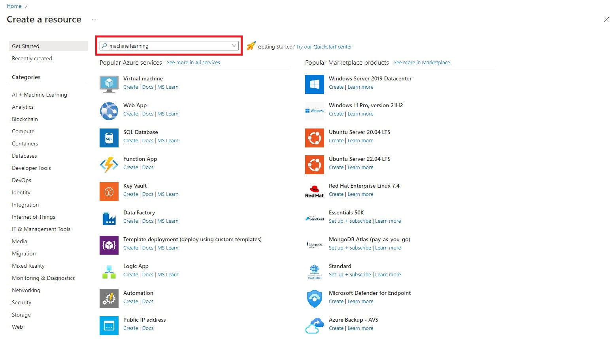
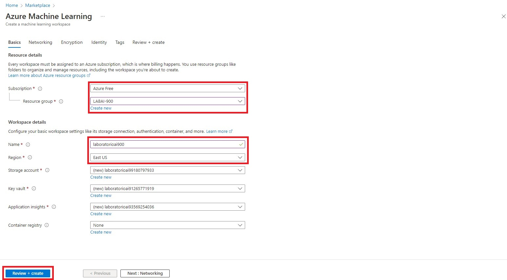

<h1>
        Trabalhando com Machine Learning na Prática no Azure ML
</h1>

Sequencia de Telas mostrando Passo a Passo do desenvolvimento do Exercicio do Microsoft Learning.

https://microsoftlearning.github.io/mslearn-ai-fundamentals/Instructions/Labs/01-machine-learning.html

##

# `Microsoft Learning.`

## `Laboratorio DIO.`

.

.

##

# `Microsoft Learning.`

## `Laboratorio DIO.`

.

##

# `Microsoft Learning.`

## `Laboratorio DIO.`

.

. 

##

# `Microsoft Learning.`

## `Laboratorio DIO.`

.

##

# `Microsoft Learning.`

## `Laboratorio DIO.`

.

##

# `Microsoft Learning.`

## `Laboratorio DIO.`

.

.

.

##

# `Microsoft Learning.`

## `Laboratorio DIO.`

.

.

##

# `Microsoft Learning.`

## `Laboratorio DIO.`

.

.

##

# `Microsoft Learning.`

## `Laboratorio DIO.`

.

.

##

# `Microsoft Learning.`

## `Laboratorio DIO.`

.

.

##

## Considerações Finais

As imagens tem o objetivo de auxiliar a alguem, que por qualquer motivo não consiga chegar ao final do exercicio.
