<h1>
        Reconhecimento Facial e transformação de imagens em Dados
</h1>

Sequencia de Telas mostrando Passo a Passo do desenvolvimento do Exercicio do Microsoft Learning.

https://microsoftlearning.github.io/mslearn-ai-fundamentals/Instructions/Labs/04-face.html

##

# `Microsoft Learning.`

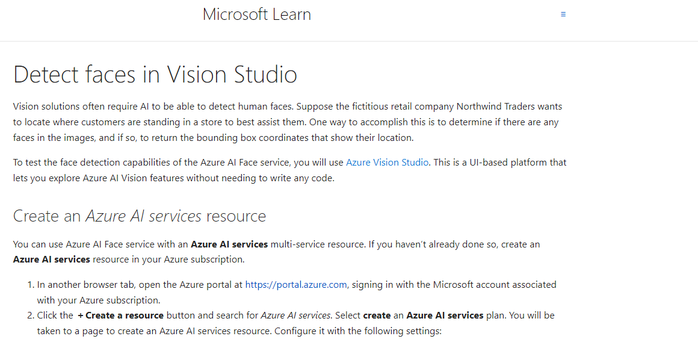

## `Laboratorio DIO.`

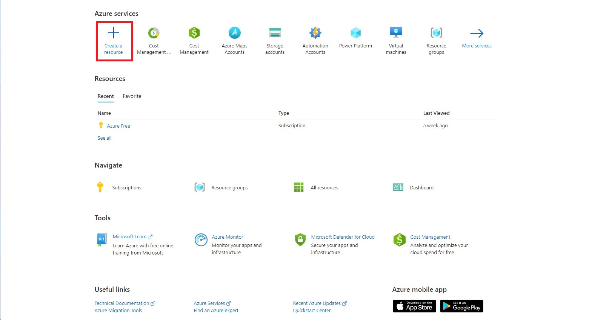
.
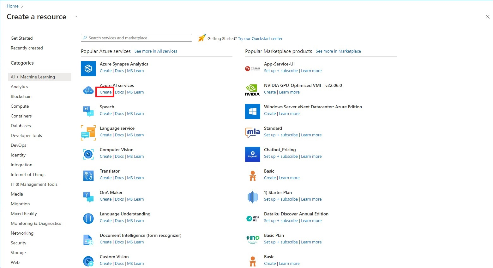

##

# `Microsoft Learning.`

## `Laboratorio DIO.`

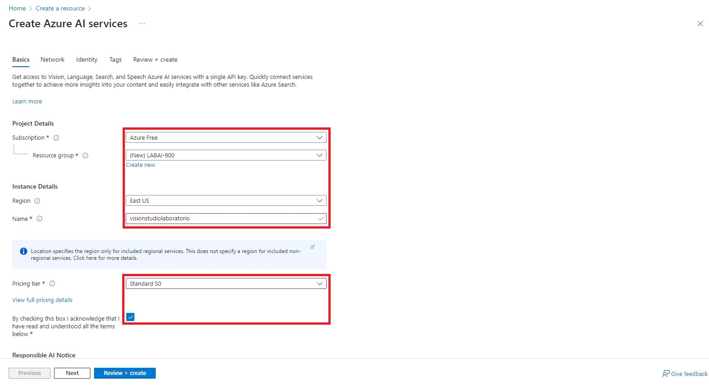

##

# `Microsoft Learning.`

## `Laboratorio DIO.`

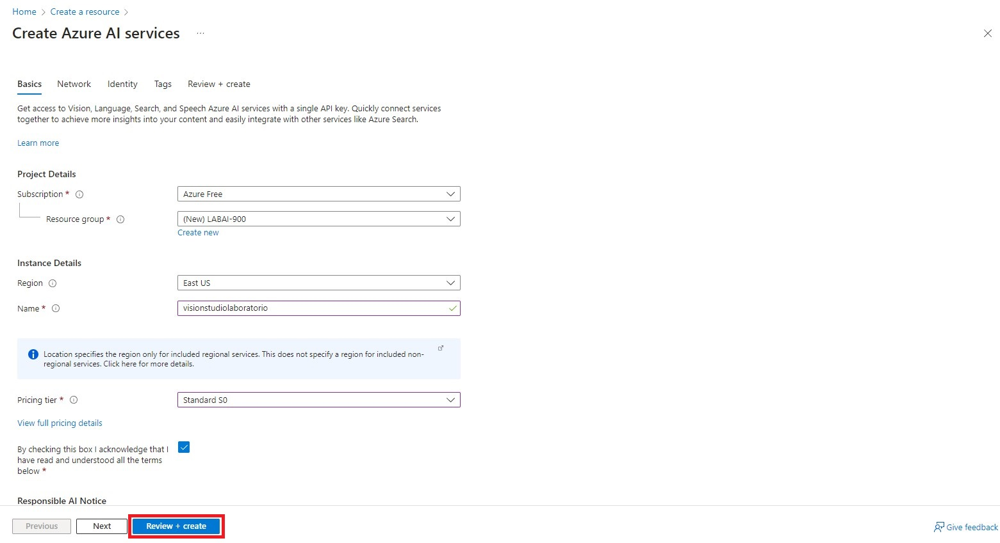
.
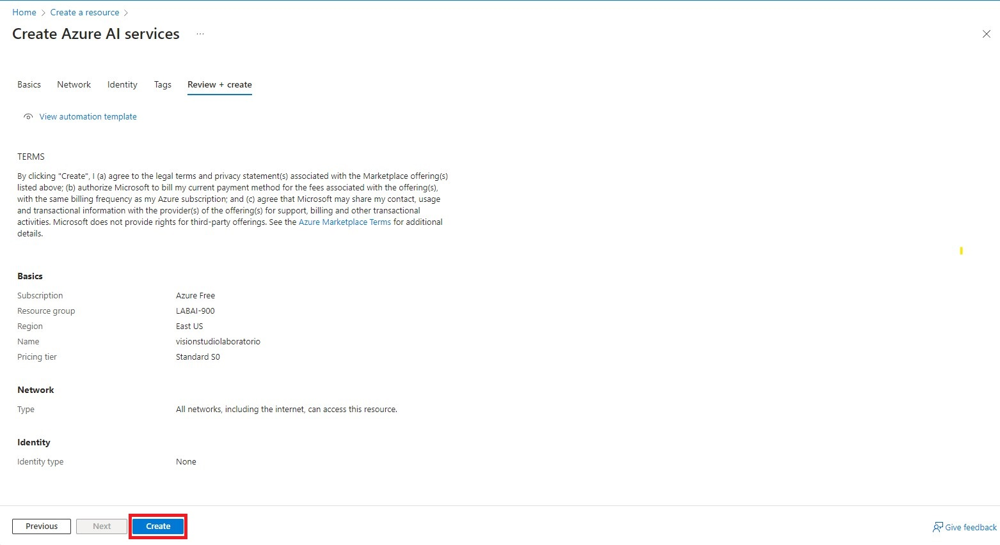
. 
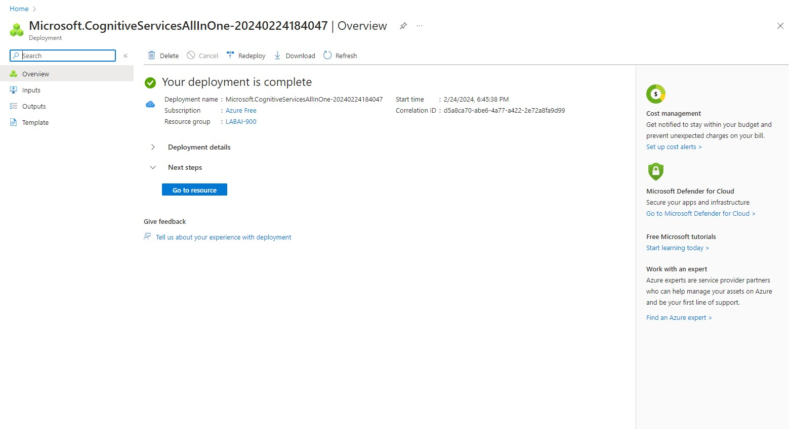

##

# `Microsoft Learning.`

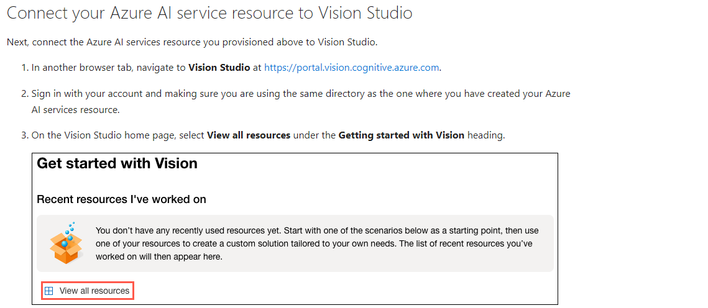

## `Laboratorio DIO.`

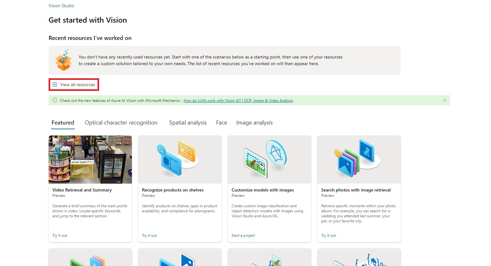

##

# `Microsoft Learning.`

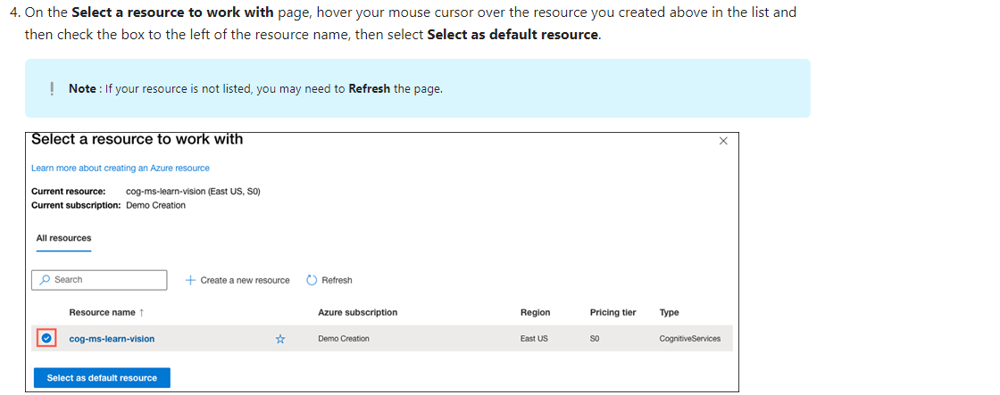

## `Laboratorio DIO.`

##

# `Microsoft Learning.`

## `Laboratorio DIO.`

##

# `Microsoft Learning.`

## `Laboratorio DIO.`

##

# `Microsoft Learning.`

## `Laboratorio DIO.`

##

# `Microsoft Learning.`

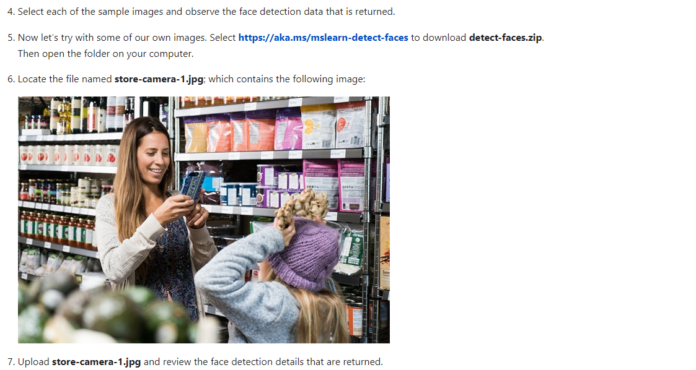

## `Laboratorio DIO.`

.

.

.

##

# `Microsoft Learning.`

## `Laboratorio DIO.`

.

##

# `Microsoft Learning.`

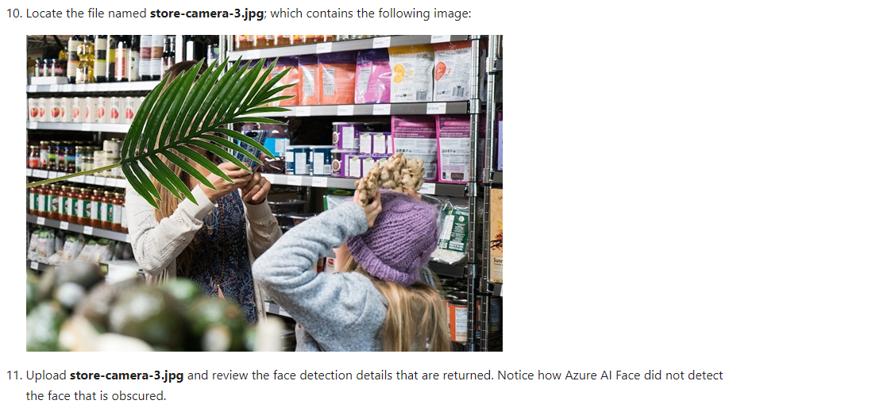

## `Laboratorio DIO.`

##

# `Microsoft Learning.`

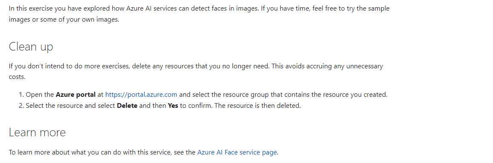

## Considerações Finais

As imagens tem o objetivo de auxiliar a alguem, que por qualquer motivo não consiga chegar ao final do exercicio.
