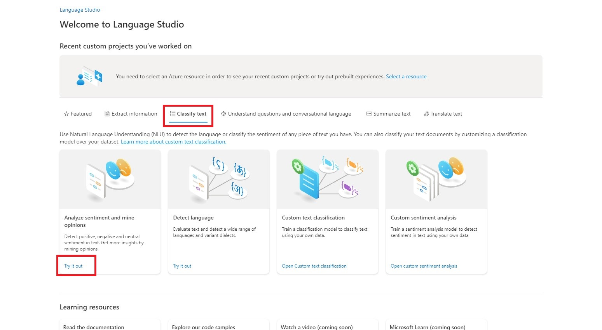
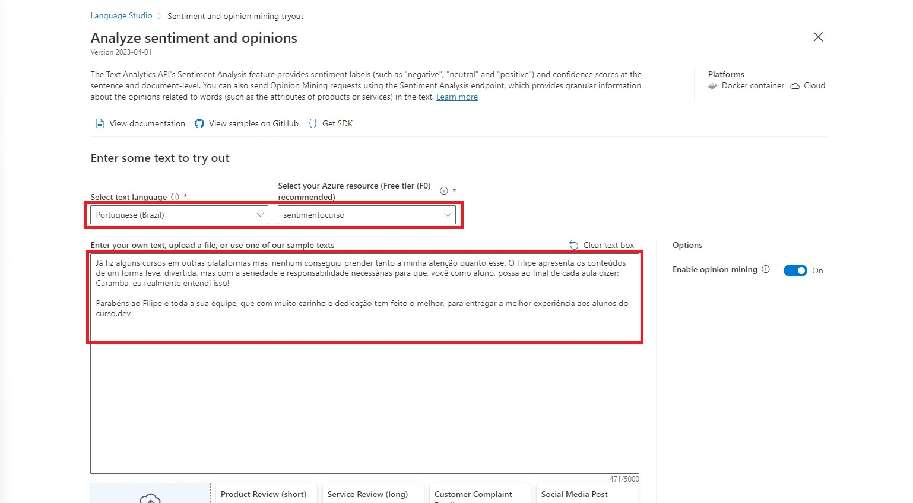
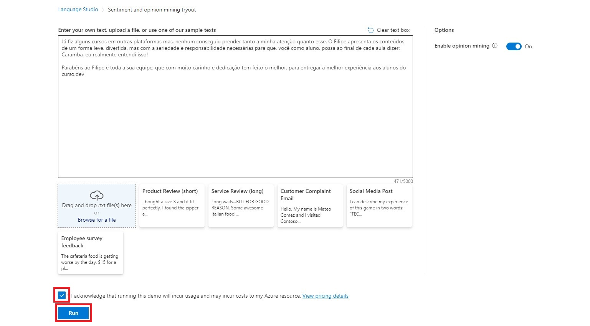
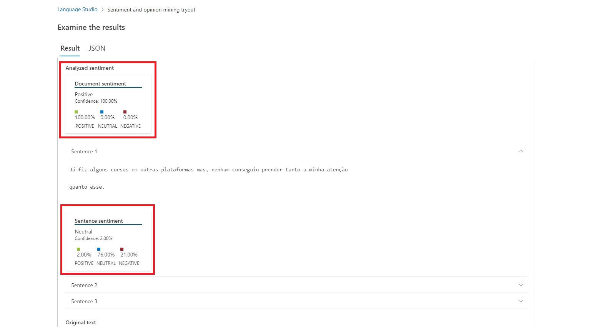
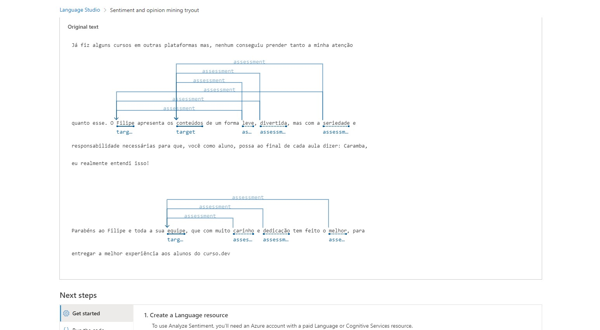
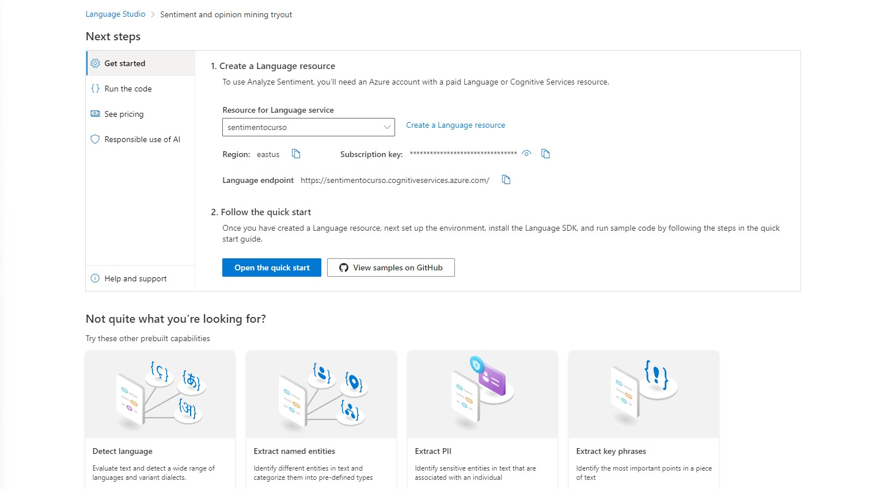

<h1>
 
Análise de Sentimentos com Language Studio 
</h1>

## Analyze sentiment and mine opinions

Através deste recurso a Inteligência Artificial analiza textos afim de descobrir o sentimento e satisfação do usuário que o escreveu, assim como as principais opiniões.

### Dentro do Language Studio guia _Classify test_ clique na opção Analyze sentiment and mine opinions:

...

...

...

...

...  

## Considerações Finais

Tal recurso facilita bastante o dia da dia de qualquer necessidade de análise de desempenho, uma vez que possibilita saber de forma ágil e simples o sentimento dos clientes no que diz respeito aos seus produtos ou serviços O que eles mais gostaram, menos gostaram e a possibilidade de voltarem a consumir o produto ou serviço. Possibilitando assim uma reação rápida perante qualquer irregularidade apontada.
