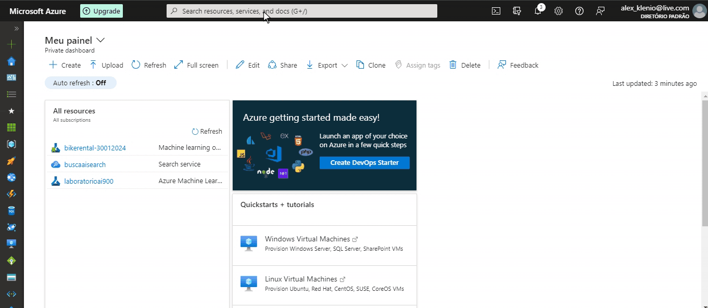
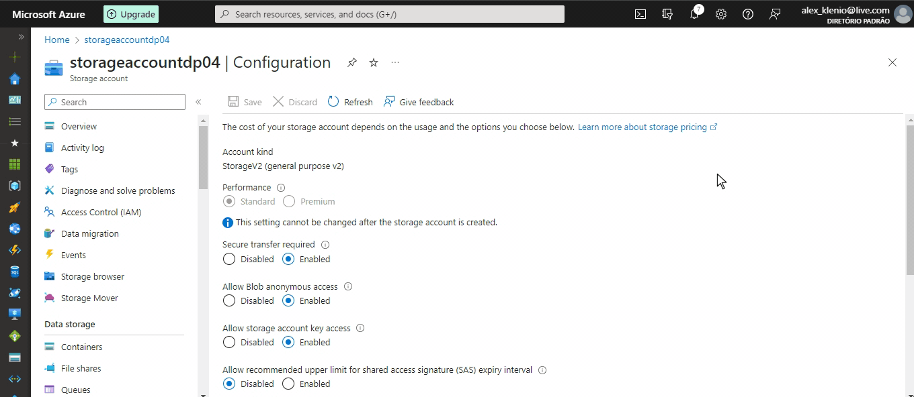
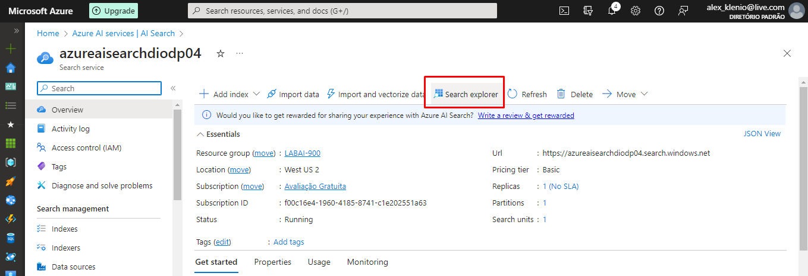
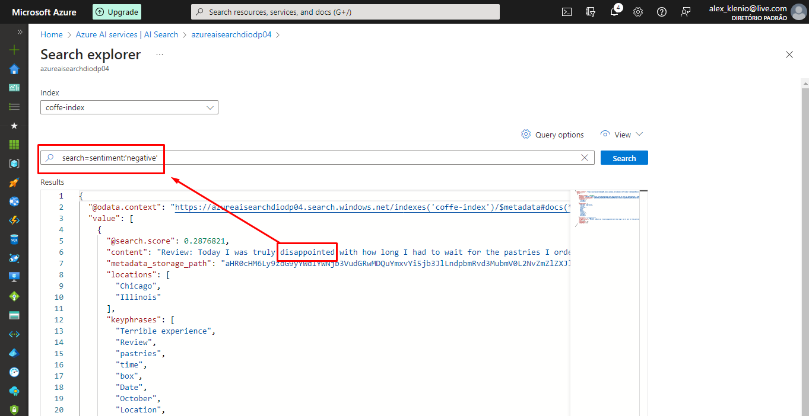

<h1>
     
Azure Cognitive Search: Utilizando AI Search para indexação e consulta de Dados
</h1>

## Desafio:

O desafio propoe que seja criada uma pesquisa que funcione juntamente com um serviço de inteligência artificial para identificar palavras chave, sentimentos, utilizando também o serviço de armazenamento do azure.

## Passo 1: Criando recurso do Asure AI Search:

  

## Passo 2: Criando recurso do Azure AI services:

  

## Passo 3: Criando o storage:

  

  

## Passo 4: Permitindo acesso anônimo ao Blob:

Como nosso laboratório é apenas didático, precisamos permitir o acesso anônimo ao blob para simplificar e facilitar nossas implementações, Após criar o seu Storage, entre no mesmo e navegue até a guia SETTINGS > CONFIGURATION seguindo os passos abaixo:

 ...

## Passo 5: Criando o Container:

Navegue até a guia DATA STORAGE > CONTAINERS, para criar o contanier dentro do storage e adicionar as pesquisas que seram analisadas pelo AI SERVICE.

  

  

## Passo 6: Importação e indexação dados para o AI SEARCH:

Neste ponto você precisa linkar / importar os dados que você inseriu e configurou no seu STORAGE, volte para o AI SEARCH e siga os passos abaixo:

  

Ao seguir a [Documentação](https://microsoftlearning.github.io/mslearn-ai-fundamentals/Instructions/Labs/11-ai-search.html) você chegará em INDEX DOCUMETS, o qual o gif acima mostra o início do processo, siga os topicos até chegar na sessão 4:

  

**4. In the Attach Cognitive Services section, select your Azure AI services resource.**

Selecione o recurso AI SERVICE configurado, e pode passar para o passo 5 . In the Add enrichments section.

Siga todas as configurações terminando no passo 17 . Select the indexer name to see more details.

## Passo 7: Cnsultando o índice:

Feitas todas as configurações vamos voltar ao AZURE AI SERVICES, entrar no nosso serviço e através do SEARCH EXPLORER testar se tudo foi indexado e se a consulta esta funcionando, utilizando os comandos:

  

#### search=\*&$count=true ( verifica se a indexação esta funcionando e mostra os documentos )

  

#### search=locations:'Chicago' ( Consulta as ocorrencias acontecidas em Chicado )

  

#### search=sentiment:'negative' ( Consulta as ocorrencias com sentimento negativo )

  

## Observações finais:

As ferramentas de inteligência artificial do Azure facilitam a consulta em documentos, pesquisas e depoimentos, agilizando ainda mais a consulta de satisfação de empresas sobre seus produtos e serviços.
