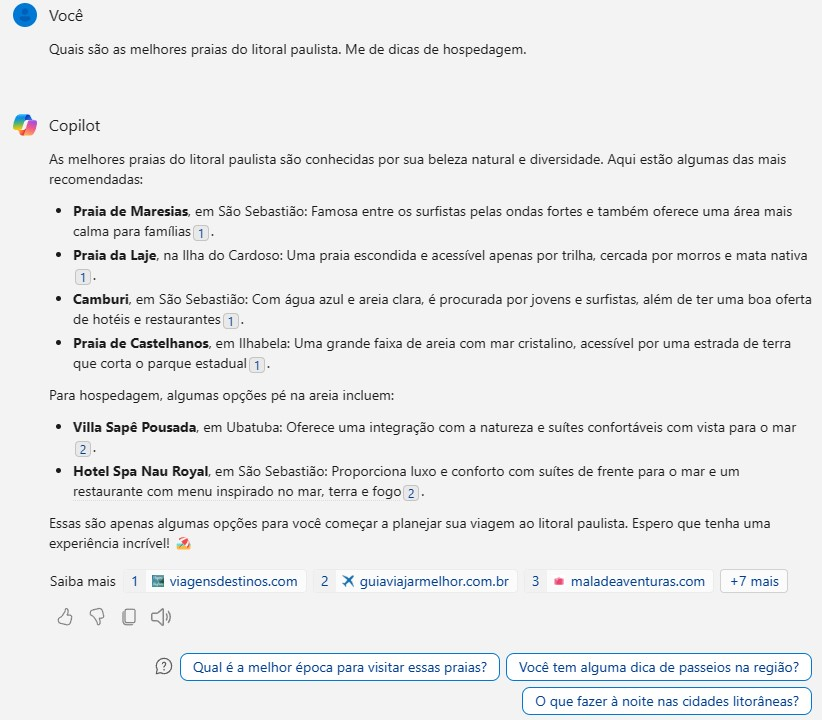
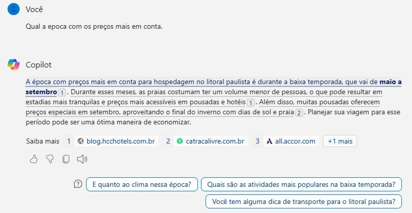
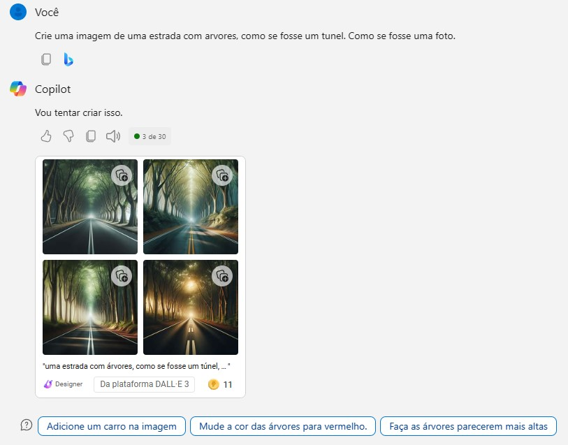
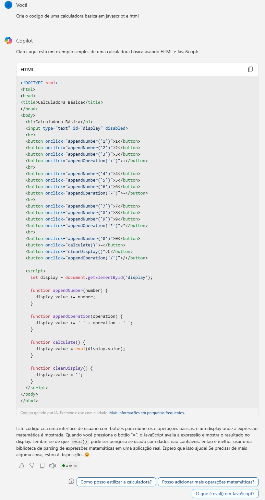
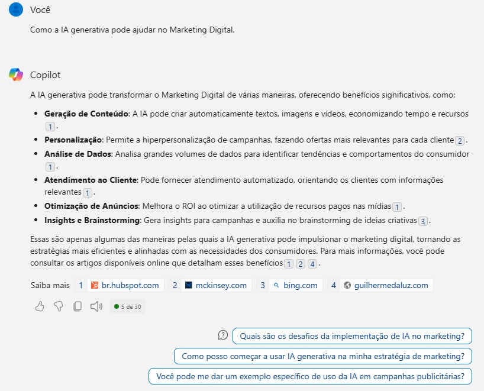

<h1>
      Explorando os Recursos de IA Generativa com Copilot e OpenAI 
</h1>

## Objetivo 🎯

Neste LAB, abordaremos o Copiloto e exploraremos os recursos da OpenAI, concentrando-nos tanto nos filtros de conteúdo quanto na criação.

Durante a prática, examinaremos de perto as funcionalidades dessas ferramentas, ao final do LAB, teremos uma compreensão mais aprofundada e prática desses recursos oferecidos pela OpenAI.

---

## Copilot.

A interação com o Copilot é estilo conversacional em linguagem natural, seguindo ao estilo da instrutora deste módulo fiz algumas perguntas sobre praias e dicas de hospedagem. Segue print dos exemplos:

..

Aumentei os detalhes das informações, perguntando sobre a melhor epoca do ano para conhecer.

..

É da natureza do Copilot que a interação seja interativa, vale a pena ir explorando as respostas em formato de conversa se os assuntos tiverem ligação entre si.

## Usando o Copilot para criar imagens

Além de geração des respostas a perguntas o Copilot tem disponível a criação de imagens usando a tecnologia do Dall-E.

Segue alguns exemplos:

..

..

## Usando o Copilot para criar código em linguagens de programação

Seguindo o exemplo da instrutora, pedi para ele gerar um código para uma calculadora.

..

## Usando o Copilot para explorar conteúdo a partir de perguntas

..

## Revisão teórica e Etapas da prática bloqueadas:

A execução PRÁTICA destes dois conteúdos (Explore Azure OpenAI e Explore content filters in Azure OpenAI) está bloqueada para usuários com contas usando e-mails particulares (hotmail, gmail, etc).

## Considerações Finais

Neste lab experimentamos a prática nas ferramentas abertas da OpenAI e já foi possível ter um gostinho do poder disponível das ferramentas de Inteligência Generativas. E acredito que é só o começo, pois o poder do uso da AI Generativa está visivelmente avançando e esta disciplina da AI é a que mais tem atraído a atenção do público em geral.
